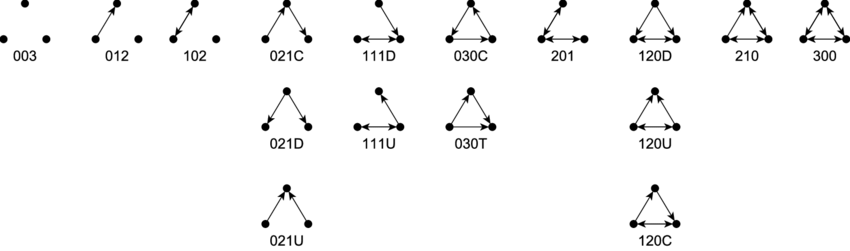

```{r setup, include=FALSE}
knitr::opts_chunk$set(echo = FALSE, message = FALSE, warning = FALSE)
suppressPackageStartupMessages(library(igraph))
suppressPackageStartupMessages(library(tidyverse))
suppressPackageStartupMessages(library(tidygraph))
suppressPackageStartupMessages(library(ggraph))
suppressPackageStartupMessages(library(flextable))

# Defining parameters
TRIALS <- 500 # number of random graphs generated to calculate expected values of parameters

```

# Understanding the results

In the tabular results for each forum network below, there are a few concepts worth outlining.

## Overall structure and definitions

**Nodes** : The nodes (or vertices, or actors, or egos...) in the network are the people involved in the forum. The total number (recorded as _nodes_ below) is just the number of students enrolled plus any academics that participated in the forum. Students in the course that did not post in the forum are included.

**Edges** : The edges in the network represent 'interactions' between students on the forum. So if Student A replies to a forum post of Student B, then this is represented by connecting those two students with an edge (line). These edges are directed; Student A replying to a post of Student B connects $A \rightarrow B$. Note that an edge in this context is a collection of forum posts (and the associated text data) between two people.

**Density** : How 'full' the network is, calculated as the ratio of edges in the graph to the total number of possible edges.

**Average Path Length** : A _path_ in this context is a series of forum-connected students, and this is the average length of this paths. It is sometimes called the _degree of separation_ or the _characteristic path length_, and along with centralisation is a key measure in graph-level summary statistics[^2].

**Transitivity** : Sometimes called the _clustering coefficient_ this measures the probability that adjacent vertices of a vertex are connected. In the context of the forum; if Student A has interacted directly on the forum with Student B *and* Student C this is the probability that Student B and Student C.

**Edge betweenness** : A measure of the 'strength' of an edge, by finding approximately how many shortest paths pass through that particular edge.  

**Centralisation** : As calculated here this uses the *betweenness* metric defined above, and aggregates the betweenness

## Triads

Studying each subset of possible 3-node subgraphs in the network has been shown to be effective in analysing affiliation networks[^5][^3]. 

### Mutual-Asymmetric-Null Triadic Classes

The Mutual-Asymmetric-Null encoding system classifies triad connections in a _directed graph_. The three numbers represent, in order, the number of (M)utual edges, the number of (A)symmetric edges, and the number of (N)ull or no edges between nodes. The possible connections (and their names) are outlined below:



### Triad Census

The _Triad Census_ classifies all 3-node subsets according to the Mutual-Asymmetric-Null class above, and is compared to the expected number of those triads for a random graph of the same number of nodes and density. 

## Expected values

All these measures are useful, but hard to know what to compare them to. One way around this is to compare them to random graphs with similar properties[^2][^4]. So for each analysed network `r TRIALS` random graphs were generated using the same number of nodes and density. The random graphs are generated using the _Erdos-Renyi_ method[^6], and then the results averaged to generate an approximate expected value of each given metric.  

``` {r analysis_functions}
# Graph analysis
analyse_graph <- function(g, trials = TRIALS) {
  n <- length(V(g)) # number of nodes
  d <- edge_density(g)
  r <- reciprocity(g)
  t <- transitivity(g)
  # Note - use 'betweenness' for centrality; number of shortest paths through a node. Seems most appropriate for this type of network 
  c <- centralization.betweenness(g)$centralization
  apl <- average.path.length(g)
  # triad census and comparison see - https://www.markanthonyhoffman.com/social_network_analysis/measuring-transitivity-and-structural-balance.html
  # Academic paper - https://arxiv.org/abs/1502.07016 
  Mutual_Asymmetric_Null_classes <-   c("003",  "012",  "102",  "021D",
                     "021U", "021C", "111D", "111U",
                     "030T", "030C", "201",  "120D",
                     "120U", "120C", "210",  "300")
  triads <- triad_census(g)
  trial_triads <- vector("list", length = trials)
  trial_reciprocity <- c()
  trial_transitivity <- c()
  trial_centralization <- c()
  trial_apl <- c()
  for (i in 1:trials) {
    rg <- erdos.renyi.game(n, d, directed = T)
    trial_triads[[i]] <- triad_census(rg)
    trial_reciprocity[[i]] <- reciprocity(rg)
    trial_transitivity[[i]] <- transitivity(rg)
    trial_centralization[[i]] <- centralization.betweenness(rg)$centralization
    trial_apl[[i]] <- average.path.length(rg)
  }
  expected_triads <- Reduce("+", trial_triads) / trials
  expected_reciprocity <- mean(trial_reciprocity)
  expected_transitivity <- mean(trial_transitivity)
  expected_centralization <- mean(trial_centralization)
  expected_apl <- mean(trial_apl)
  triad_df <- tibble(MAN_class = Mutual_Asymmetric_Null_classes,
                     Triads = triads,
                     expected = expected_triads)
  return(list(Nodes = n, Desnsity = d, 
              Reciprocity = r, `Expected Reciprocity` = expected_reciprocity, 
              `Transitivity` = t, `Expected Transitivity` = expected_transitivity,
              `Centralization` = c, `Expected Centralization` = expected_centralization,
              `Average Path Length` = apl, `Expected APL` = expected_apl,
              `Triad Census` = triad_df))
}
```

``` {r importing_data}
fmA1 <- rdata.psych::gfmBio17
fmA2 <- rdata.psych::gfmBio18
fmB1 <- rdata.psych::gfmSoc17
fmB2 <- rdata.psych::gfmSoc18
```

``` {r plotting_functions}
plot_simple_forum_1 <- function(g) {
  g %>% 
    ggraph(layout = "nicely") +
    geom_edge_link(aes(alpha = hits)) +
    geom_node_point() +
    theme_graph() +
      theme(legend.position = "none")
}

plot_simple_forum_2 <- function(g) {
  g %>% 
    ggraph(layout = "nicely") +
    geom_edge_link(aes(alpha = hits)) +
    geom_node_point(aes(size = grade_quartile)) +
    scale_size_continuous(trans = "exp", limits = c(1,4)) +
    theme_graph() +
    theme(legend.position = "none")
}

plot_forum <- function(g, nc = NULL, focus = TRUE, layout = 'stress',
                       loops = FALSE, edge_type = "fan") {
    if (focus) {
        g <- g %>% activate(nodes) %>% filter(!node_is_isolated())
    }
    p <- g %>% 
        ggraph(layout = layout)
    
    if (edge_type == "fan") {
        p <- p +
            geom_edge_fan(aes(alpha = weight, color = hits))
    } else {
        p <- p +
            geom_edge_link(aes(alpha = hits))
    }
    p <- p +
      scale_edge_color_gradient(low = "gray", high = "black") +
      geom_node_point(aes(size = grade_quartile/2,
                          color = {{nc}})) +
      scale_size_continuous(trans = "exp") +
      scale_color_gradient(low = "darkred", high = "orange",
                           trans = "sqrt") + 
      theme_graph() +
      theme(legend.position = "none")
    if (loops) {
        p <- p +
            geom_edge_loop(aes(alpha = weight))
    }
    return(p)
}
```

# Comparisons

## Subject A, 2017

``` {r forum_plots_A1}
fm <- fmA1

plot_forum(fm, nc = ForumViews, edge_type = "link",
           focus = FALSE, layout = "nicely")  
plot_forum(fm, nc = ForumViews, edge_type = "link") +
    ggtitle("All Forums") 
plot_forum(fm, nc = ForumViews, edge_type = "link") + 
    facet_edges( ~ forum) + 
    ggtitle('Split By Forum')
```


``` {r a1_table, results = "asis"}
fm <- fmA1

features <- analyse_graph(fm) 
flextable(as.data.frame(features[1:8]))
flextable(features$`Triad Census`) %>% colformat_num(col_keys = c("Triads", "expected"), digits = 0)
```

Same as above, but with the isolated points removed:

``` {r a1_table__zoom, results = "asis"}
fm <- fmA1

features <- analyse_graph(fm %>% 
                            activate(nodes) %>% 
                            filter(!node_is_isolated())) 
flextable(as.data.frame(features[1:8]))
flextable(features$`Triad Census`) %>% colformat_num(col_keys = c("Triads", "expected"), digits = 0)
```


## Subject A, 2018

``` {r forum_plots_A2}
fm <- fmA2

plot_simple_forum_1(fm %>% activate(nodes) %>% filter(!node_is_isolated()))
plot_simple_forum_2(fm)

plot_forum(fm, nc = ForumViews, edge_type = "link",
           focus = FALSE, layout = "nicely") 
plot_forum(fm, nc = ForumViews, edge_type = "link") +
    ggtitle("All Forums") 
plot_forum(fm, nc = ForumViews, edge_type = "link") + 
    facet_edges( ~ forum) + 
    ggtitle('Split By Forum')
```


``` {r a2_table, results = "asis"}
fm <- fmA2

features <- analyse_graph(fm) 
flextable(as.data.frame(features[1:8]))
flextable(features$`Triad Census`) %>% colformat_num(col_keys = c("Triads", "expected"), digits = 0)
```

Same as above, but with the isolated points removed:

``` {r a2_table__zoom, results = "asis"}
fm <- fmA2

features <- analyse_graph(fm %>% 
                            activate(nodes) %>% 
                            filter(!node_is_isolated())) 
flextable(as.data.frame(features[1:8]))
flextable(features$`Triad Census`) %>% colformat_num(col_keys = c("Triads", "expected"), digits = 0)
```

## Subject B, 2017

``` {r forum_plots_B1}
fm <- fmB1

plot_forum(fm, nc = ForumViews, edge_type = "link",
           focus = FALSE, layout = "nicely") 
plot_forum(fm, nc = ForumViews, edge_type = "link") +
    ggtitle("All Forums") 
plot_forum(fm, nc = ForumViews, edge_type = "link") + 
    facet_edges( ~ forum) + 
    ggtitle('Split By Forum')
```


``` {r b1_table, results = "asis"}
fm <- fmB1

features <- analyse_graph(fm) 
flextable(as.data.frame(features[1:8]))
flextable(features$`Triad Census`) %>% colformat_num(col_keys = c("Triads", "expected"), digits = 0)
```

Same as above, but with the isolated points removed:

``` {r b1_table__zoom, results = "asis"}
fm <- fmB1

features <- analyse_graph(fm %>% 
                            activate(nodes) %>% 
                            filter(!node_is_isolated())) 
flextable(as.data.frame(features[1:8]))
flextable(features$`Triad Census`) %>% colformat_num(col_keys = c("Triads", "expected"), digits = 0)
```

## Subject B, 2018

``` {r forum_plots_B2}
fm <- fmB2

plot_forum(fm, nc = ForumViews, edge_type = "link",
           focus = FALSE, layout = "nicely") 
plot_forum(fm, nc = ForumViews, edge_type = "link") +
    ggtitle("All Forums") 
plot_forum(fm, nc = ForumViews, edge_type = "link") + 
    facet_edges( ~ forum) + 
    ggtitle('Split By Forum')
```


``` {r b2_table, results = "asis"}
fm <- fmB2

features <- analyse_graph(fm) 
flextable(as.data.frame(features[1:8]))
flextable(features$`Triad Census`) %>% colformat_num(col_keys = c("Triads", "expected"), digits = 0)
```

Same as above, but with the isolated points removed:

``` {r b2_table__zoom, results = "asis"}
fm <- fmB2

features <- analyse_graph(fm %>% 
                            activate(nodes) %>% 
                            filter(!node_is_isolated())) 
flextable(as.data.frame(features[1:8]))
flextable(features$`Triad Census`) %>% colformat_num(col_keys = c("Triads", "expected"), digits = 0)
```

# Analysis

## Triadic Census Transitions

The closed triads where not as consistent across the four forums, but did show some change from 2017 to 2018,and differences between the two subjects. Note that the *expected* number of triads for each of this closed triads was close to 0 for the complete graph, and only reached around 5 for some of the *120_* triads in some of the networks.

``` {r triad_progression}
df <- tibble(`MAN class` = c("120D", "120U", "120C", "210", "300"),
             `Sub A 2017` = analyse_graph(fmA1)$`Triad Census`$Triads[12:16],
             `Sub A 2018` = analyse_graph(fmA2)$`Triad Census`$Triads[12:16],
             `Sub B 2017` = analyse_graph(fmB1)$`Triad Census`$Triads[12:16],
             `Sub B 2018` = analyse_graph(fmB2)$`Triad Census`$Triads[12:16]
             )
flextable(df) %>% colformat_num(col_keys = c("Sub A 2017", "Sub A 2018", "Sub B 2017", "Sub B 2018"),
                                digits = 0)
```

## Triadic Census with Clusters and Academic Groups

We can take subgraphs that involve only edges of posts by a particular cluster, and then look at the triadic census of each of these subgraphs. We can repeat this by using the grade quartile as the grouping variable instead of cluster and compare.

``` {r triadic_clustering_functions}
triad_single <- function(graph, group_var, group, undirected = FALSE) {
  sub_graph <- graph %>% 
    activate(nodes) %>% 
    filter({{group_var}} == group)
  census <- analyse_graph(sub_graph)$`Triad Census`$Triads
  if (undirected) {
    census <- c(census[1], 
                sum(census[2:3]),
                sum(census[4:8], census[11]),
                sum(census[9:10], census[12:16]))
    df <- data.frame(Type = c("0", "1", "2", "3"),
                     group = census)
  } else {
    df <- data.frame(Type = c("003",  "012",  "102",  "021D",
                     "021U", "021C", "111D", "111U",
                     "030T", "030C", "201",  "120D",
                     "120U", "120C", "210",  "300"),
                     group = census)
  }
  names(df) <- c("Triad", group)
  return(df)
}

triad_of_group <- function(graph, group_var, undirected = FALSE) {
  groups <- graph %>% 
    activate(nodes) %>% 
    as_tibble() %>% 
    filter(!is.na({{group_var}})) %>% 
    pull({{group_var}}) %>% 
    unique()
    
  df <- groups %>%
    as.list() %>% 
    map(.f = ~triad_single(graph, {{group_var}}, ., undirected = undirected)[2]) %>% 
    bind_cols()
  
  if (undirected) {
    df$Triad <- c("0", "1", "2", "3")
  } else {
    df$Triad <- c("003",  "012",  "102",  "021D",
                  "021U", "021C", "111D", "111U",
                  "030T", "030C", "201",  "120D",
                  "120U", "120C", "210",  "300")
  }
  df <- df %>% select(Triad, everything())
  
  return(df)
}
```

``` {r}
# TODO: Call the functions above.
# Also could look at grouping the directed census in an intelligent way
# to best look at heirarchical structures
```

## Homophily

Examining the chance that two nodes are conected based on having similar properties. Need more data for this, only really relevant for the grade quartile data at the moment. Krackhardt's E-I Index[^7] represents the ratio of internal to external ties:

$$E-I\ Index=\frac{EL - IL}{EL + IL}$$

In the above $EL$ is the number of external links and $IL$ is the number of internal links. Values closer to 1 indicate more heterophily (links between groups are common) where as values closer to -1 indicate more homophily (links within groups are more common).

``` {r homophily_functions}
# taken from https://stackoverflow.com/questions/51951713/computation-of-network-homophily
homophily <- function(graph, vertex.attr, attr.val=NULL, prop=T){
  V(graph)$name<-vertex_attr(graph,vertex.attr)
  ee<-get.data.frame(graph)
  if(is.null(attr.val)){
    ifelse(prop==T,sum(ee[,1]==ee[,2])/nrow(ee),sum(ee[,1]==ee[,2]))
  } else {
    ifelse(prop==T,sum(ee[,1]==attr.val & ee[,2]==attr.val)/nrow(ee[ee[,1]==attr.val|ee[,2]==attr.val,]),
           sum(ee[,1]==attr.val & ee[,2]==attr.val))
  }
}

homophily_detail <- function(graph, vertex.attr) {
  V(graph)$name <- vertex_attr(graph, vertex.attr)
  edges <- get.data.frame(graph)

  # heterophilous ties where vertices have different `"group"` attributes
  external <- length(which(edges$from != edges$to))

  # homophilous ties where vertices have the same `"group"` attributes
  internal <- length(which(edges$from == edges$to))

  list(
    n_external = external,
    n_internal = internal,
    prop_external = external / nrow(edges), # proportion of ties that are heterophilous
    prop_internal = internal / nrow(edges), # proportion of ties that are homophilous (the results of your initial function)
    ei_index = (external - internal) / nrow(edges)     # (EL - IL) / (EL + IL). Values closer to -1 are more homophilic and closer to 1 are heterophilic
  )
}

ei_global <- function(x, vrt_attr) {
  attrs <- vrt_get_attr(x, vrt_attr)
  el <- matrix(attrs[get_el(x)], ncol = 2L)
  n_edges <- nrow(el)
  external <- length(el[, 1L][el[, 1L] != el[, 2L]])
  internal <- n_edges - external
  (external - internal) / n_edges
}

```

``` {r homophily}
vars <- c("grade_quartile", 
          "cluster_2",
          "cluster_3",
          "cluster_4",
          "cluster_5")

ei_df <- tibble(group = vars,
                `Sub A 2017` = map_dbl(.x = vars,
                               .f = ~homophily_detail(fmA1, .x)$ei_index),
                `Sub A 2018` = map_dbl(.x = vars,
                               .f = ~homophily_detail(fmA2, .x)$ei_index),
                `Sub B 2017` = map_dbl(.x = vars,
                               .f = ~homophily_detail(fmB1, .x)$ei_index),
                `Sub B 2018` = map_dbl(.x = vars,
                               .f = ~homophily_detail(fmB2, .x)$ei_index),
)

ei_df %>% 
    flextable::flextable() %>% 
    flextable::set_caption("E-I Index")
```


# References

[^1]: Grunspan, Wiggins & Goodreau (2017). *Understanding Classrooms through Social Network Analysis: A Primer for Social Network Analysis in Education Research* https://www.lifescied.org/doi/10.1187/cbe.13-08-0162

[^2]: D. Watts & S. Strogatz (1998). *Collective dynamics of ‘small-world’ networks* http://dx.doi.org/10.1038/30918

[^3]: Brunson (2016). *Triadic analysis of affiliation networks* https://arxiv.org/pdf/1502.07016.pdf

[^4]: Bearman & Hoffman (2017). *Social Network Analysis* https://www.markanthonyhoffman.com/social_network_analysis/index.html

[^5]: Davis, J.A. and Leinhardt, S. (1972). *The Structure of Positive Interpersonal Relations in Small Groups.* In J. Berger (Ed.), Sociological Theories in Progress, Volume 2, 218-251. Boston: Houghton Mifflin.

[^6]: Erdos, P. and Renyi, A., (1959). *On random graphs, Publicationes Mathematicae 6*, 290–297.

[^7]: Krackhardt, David, and Robert N. Stern. *Informal Networks and Organizational Crises: An Experimental Simulation.* Social Psychology Quarterly 51, no. 2 (1988): 123-40. http://www.jstor.org/stable/2786835.